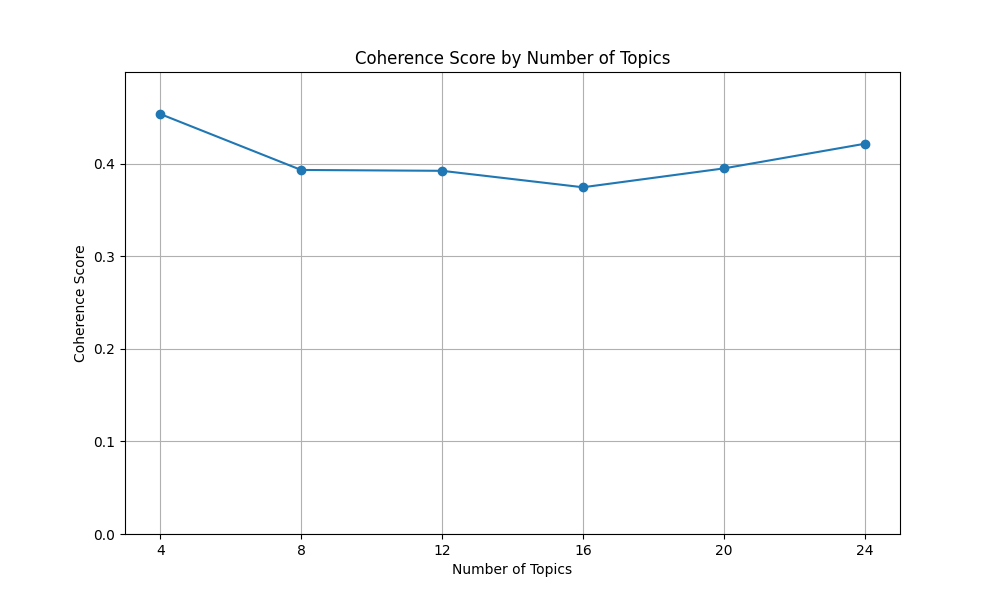
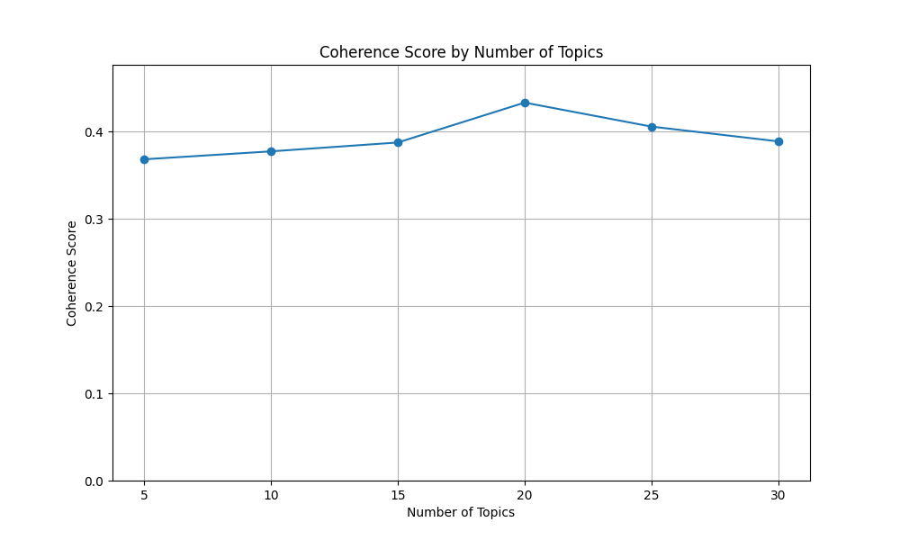
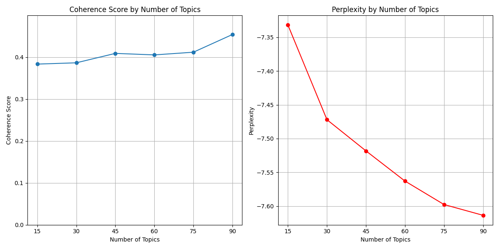
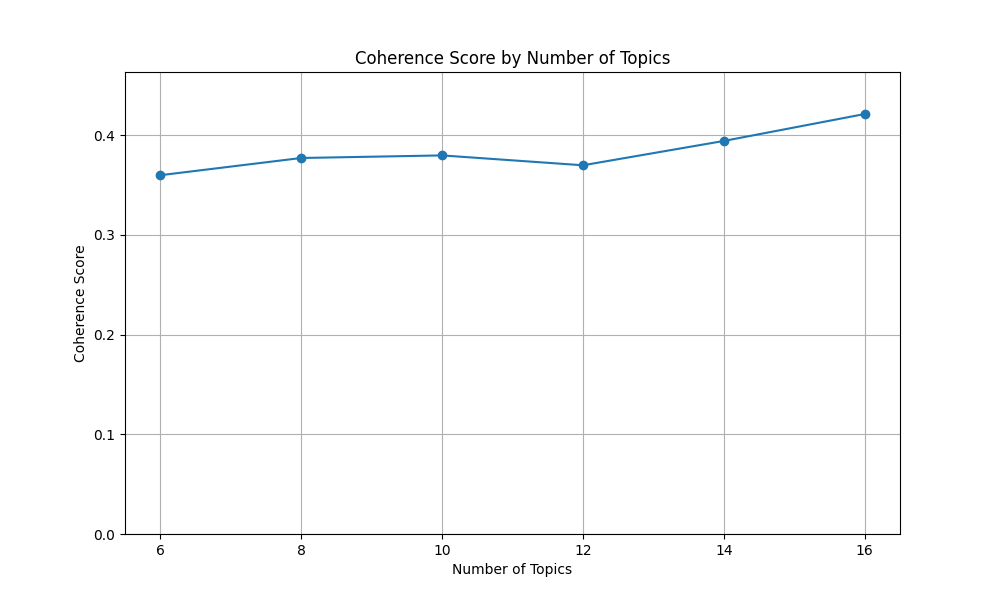

# Coherence Score Results

## From the outputs , the  coherence scores for different iterations:
* Iteration 1: 0.4538 (4 topics)
* Iteration 2: 0.3933 (8 topics)
* Iteration 3: 0.3924 (12 topics)
* Iteration 4: 0.3746 (16 topics)
* Iteration 5: 0.3950 (20 topics)
* Iteration 6: 0.4217 (24 topics)

 
 

 
  

